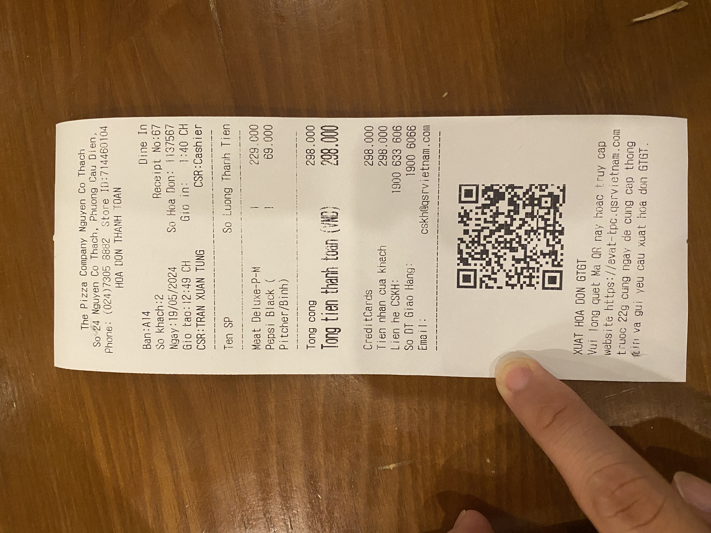
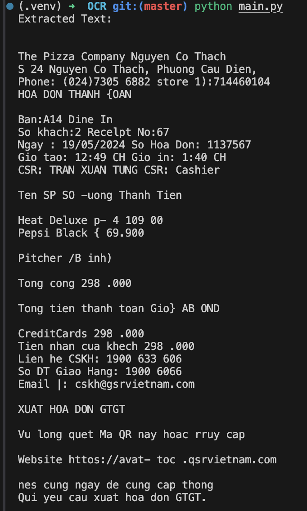

Sample OCR
==========

<div class="container">
<div class="row" style="display: flex; justify-content: space-around;">
<div class="col">

</div>
<div class="col">

</div>
</div>
</div>

1. **Set up your environment:**
   - Install Python (if not already installed).
   - Install required libraries: `Pillow` for image handling, `pytesseract` for OCR, and `opencv-python` for image processing.

   ```sh
   python3 -m venv .venv
   source .venv/bin/activate
   ```

2. **Install Tesseract:**
   - Download and install Tesseract from [here](https://github.com/tesseract-ocr/tesseract).

3. **Write the Python script:**

Here’s a detailed script to get you started:

### Step 1: Install the necessary libraries

```bash
pip install pillow pytesseract opencv-python
```

### Step 2: Write the Python code

```python
import cv2
import pytesseract
from PIL import Image
import numpy as np

# Path to the tesseract executable
pytesseract.pytesseract.tesseract_cmd = r'C:\Program Files\Tesseract-OCR\tesseract.exe'  # Update this path based on your installation

def preprocess_image(image_path):
    # Read the image using OpenCV
    image = cv2.imread(image_path)
    
    # Convert to grayscale
    gray = cv2.cvtColor(image, cv2.COLOR_BGR2GRAY)
    
    # Apply thresholding
    _, thresh = cv2.threshold(gray, 150, 255, cv2.THRESH_BINARY + cv2.THRESH_OTSU)
    
    # Optionally, apply additional processing like noise reduction
    # blur = cv2.GaussianBlur(thresh, (1, 1), 0)
    
    return thresh

def extract_text_from_image(image_path):
    # Preprocess the image
    processed_image = preprocess_image(image_path)
    
    # Use pytesseract to extract text
    text = pytesseract.image_to_string(processed_image)
    
    return text

if __name__ == "__main__":
    # Path to the image
    image_path = 'path_to_your_image.jpg'  # Update with your image path

    # Extract text
    text = extract_text_from_image(image_path)
    print("Extracted Text:\n", text)
```

### Step 3: Explanation of the Code

1. **Importing Libraries:**
   - `cv2` is OpenCV for image processing.
   - `pytesseract` is the Python wrapper for Tesseract.
   - `PIL` (Python Imaging Library) for additional image handling.
   - `numpy` for numerical operations (used by OpenCV).

2. **Preprocessing the Image:**
   - Load the image using OpenCV.
   - Convert the image to grayscale, which is often more suitable for OCR.
   - Apply thresholding to binarize the image, improving the contrast between the text and the background.

3. **Extracting Text:**
   - `pytesseract.image_to_string()` is used to perform OCR on the preprocessed image.

4. **Running the Script:**
   - Update the path to your image and the Tesseract executable.
   - Run the script to see the extracted text from the image.

### Tips for Better Accuracy
- Experiment with different preprocessing techniques like denoising, blurring, and edge detection to improve OCR accuracy.
- Ensure the image is clear and the text is legible.
- Adjust the thresholding parameters if necessary.
